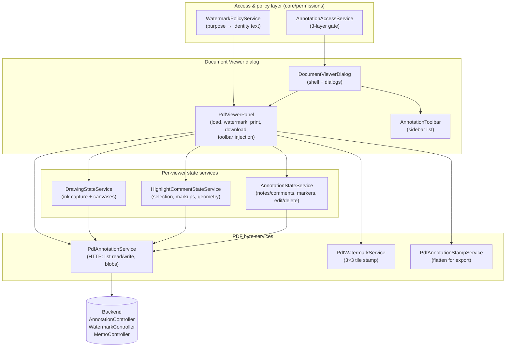
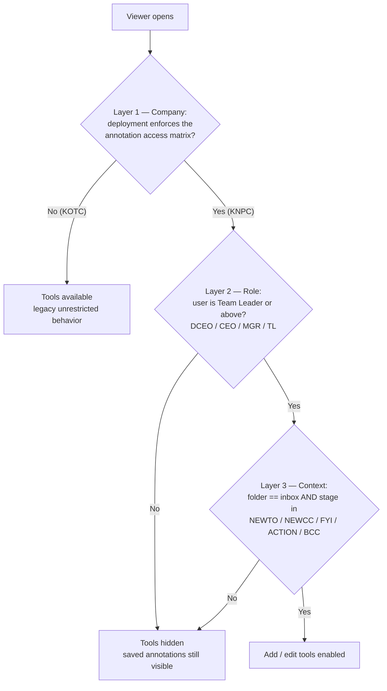
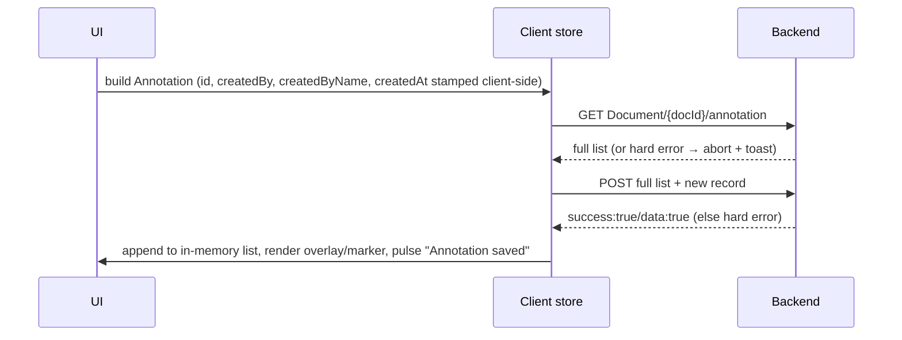
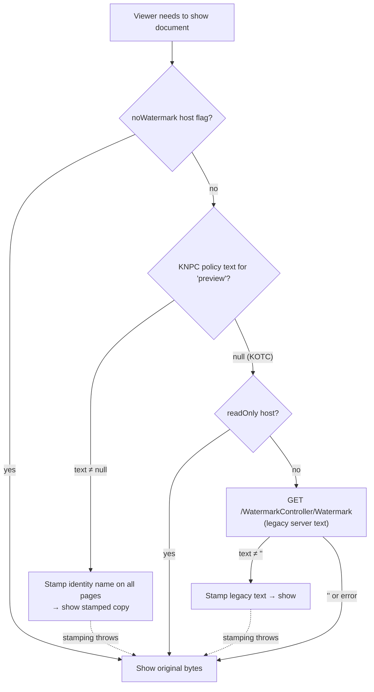
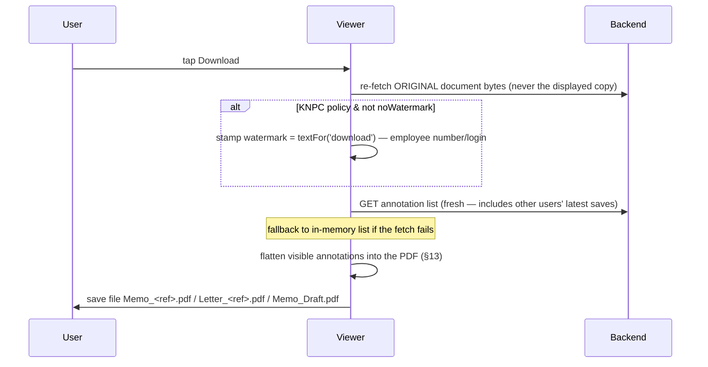
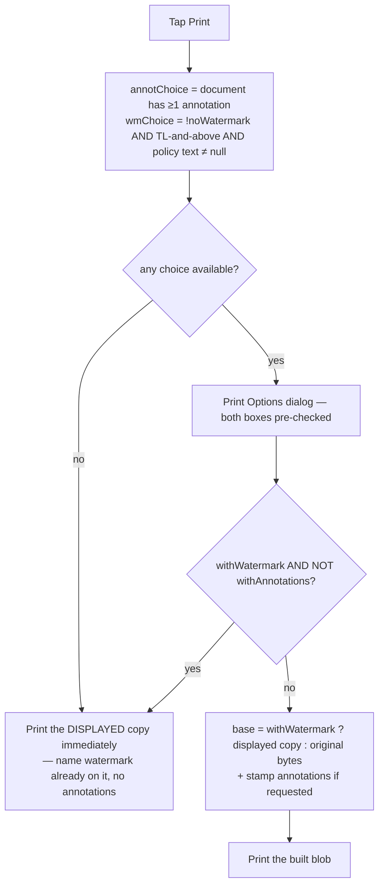

> **Audience:** the mobile team re-implementing the Document Viewer's **annotation** and **watermark** behavior against the existing EasyMemo backend. No Angular, pdf.js, or web knowledge is assumed — web source paths are given only as the authoritative reference.
> **Source of truth:** reverse-engineered from the production Angular web client, August 2026. Everything here reflects what the web app actually does today, including backend quirks the server **requires**.
> **Screenshots:** every screenshot in this document is a **real capture from the running KNPC web app** (`COMPANY: "KNPC"`, test backend, signed in as `ECMTest_Mgr_CP` — job title Manager, i.e. inside the "Team Leader and above" set). They were taken while actually creating a sticky note and a highlight on memo `O-MOG-MGR-26-0067`, and both annotations really persisted to `AnnotationController`. Diagrams and ASCII wireframes are kept alongside them where they explain structure or geometry better than a photo can.

---

## Table of contents

1. [Overview — what these features are](#/annotation-watermark-spec#1-overview)
2. [The three-layer access gate](#/annotation-watermark-spec#2-the-three-layer-access-gate)
3. [Access matrix — who / where / when](#/annotation-watermark-spec#3-access-matrix)
4. [Backend API contract](#/annotation-watermark-spec#4-backend-api-contract)
5. [Data model](#/annotation-watermark-spec#5-data-model)
6. [Coordinate system & geometry](#/annotation-watermark-spec#6-coordinate-system-geometry)
7. [Annotation types — behavior per type](#/annotation-watermark-spec#7-annotation-types)
8. [Viewer UI spec](#/annotation-watermark-spec#8-viewer-ui-spec)
9. [Persistence flows & failure handling](#/annotation-watermark-spec#9-persistence-flows-failure-handling)
10. [Watermark system](#/annotation-watermark-spec#10-watermark-system)
11. [Download pipeline](#/annotation-watermark-spec#11-download-pipeline)
12. [Print pipeline](#/annotation-watermark-spec#12-print-pipeline)
13. [Flattening annotations into the PDF (export contract)](#/annotation-watermark-spec#13-flattening-annotations-into-the-pdf)
14. [Where the viewer appears (host matrix)](#/annotation-watermark-spec#14-host-matrix)
15. [KNPC vs KOTC summary](#/annotation-watermark-spec#15-knpc-vs-kotc-summary)
16. [i18n key inventory](#/annotation-watermark-spec#16-i18n-key-inventory)
17. [Known gaps, quirks & backend handoffs](#/annotation-watermark-spec#17-known-gaps-quirks-backend-handoffs)
18. [Mobile implementation checklist](#/annotation-watermark-spec#18-mobile-implementation-checklist)
19. [Appendix A — how these screenshots were produced](#/annotation-watermark-spec#appendix-a-how-these-screenshots-were-produced-and-what-they-prove)
20. [Appendix B — web source file map](#/annotation-watermark-spec#appendix-b-web-source-file-map)

---

## 1. Overview

Two related but independent features live inside the PDF **Document Viewer** that opens when a user views a memo/letter document:

**Annotations** — users mark up the document with six annotation kinds:

| Kind | `type` value | What it is |
|---|---|---|
| Sticky note | `text` | A note anchored to a free click-position on the page (no text selection) |
| Comment | `comment` | A note anchored to a **text selection** (marker bubble + tinted selection) |
| Highlight | `highlight` | Filled color overlay over the selected words |
| Underline | `underline` | Thin bar under the selected words |
| Strikeout | `strikeout` | Thin bar through the middle of the selected words |
| Freehand drawing | `drawing` | Ink strokes drawn with a pen/finger/mouse |

All six kinds persist through **one backend endpoint** that stores the *entire annotation list of a document as a single JSON string* (§4). Annotations are shared: every user who opens the document sees all saved annotations. **Adding** them is restricted (§2–3); **viewing** them is not.

**Watermark** — a KNPC compliance requirement that stamps the identity of the person handling the document onto every page:

| Purpose | Watermark text |
|---|---|
| Preview (on-screen) | Viewing user's **employee name** |
| Download | Acting user's **employee number** (currently the ECM login stands in — §10.2) |
| Print | Printing user's **employee name**; "Team Leader and above" may opt out |

The watermark is stamped **client-side** by manipulating the PDF bytes (the web uses `pdf-lib`; mobile needs an equivalent PDF-writing library). The backend never watermarks previews — only the copies it emails itself (backend handoff, §17).

Both features are **company-gated**: they are enforced on KNPC deployments and dormant on KOTC (§15).

### High-level architecture (web reference)



---

## 2. The three-layer access gate

"May this user **add/edit** annotations in this viewer right now?" stacks **three independent layers**. All three must pass. Never collapse them into one check — they change independently.



| Layer | Rule | Web source |
|---|---|---|
| 1 — Company | Feature `ANNOTATION_ACCESS_MATRIX` is mapped to `company === 'KNPC'`. When **off** the whole gate short-circuits to *allowed* (KOTC keeps its historical unrestricted tools). | `src/app/core/company/company-feature.map.ts` |
| 2 — Role | Permission `ANNOTATE_DOCUMENT` = job title in `{DCEO, CEO, MGR, TL}`. **SENG (Senior Engineer) is deliberately excluded** — the KNPC requirement's own example forwards a memo from a TL *down* to "a Senior or Engineer". Secretaries and staff can view but never add. The role is evaluated on the **effective user** (the delegator when acting under delegation). | `src/app/core/permissions/permission.map.ts` |
| 3 — Context | Folder + workflow stage of the hosting screen (§3). | `src/app/core/permissions/annotation-access.policy.ts` |

Additional per-viewer switch: each viewer instance has a `readOnly` flag. Final tool availability is:

```
toolsEnabled = !readOnly AND gate(company, role, context)
```

**What the gate does and does not control:**

- Gated: the selection toolbar, the sticky-note and draw toolbar buttons, edit/delete actions.
- **Not** gated: rendering of saved annotations, the show/hide (eye) toggles, the annotation sidebar list, print/download buttons (any viewer exports the document *with* the saved annotations baked in).

The watermark has its own company gate — feature `WATERMARK_IDENTITY_POLICY`, also `company === 'KNPC'` — plus one role-gated escape hatch: permission `PRINT_WITHOUT_WATERMARK` (same TL-and-above set) lets the user print without the watermark (§12).

---

## 3. Access matrix

### 3.1 Folder dimension

The screen hosting the viewer declares which "folder" it is. Only `inbox` may add annotations.

| Folder value | Screen | Add tools possible? |
|---|---|---|
| `inbox` | Work-item details opened from an assigned Inbox task | ✅ (if stage also allows) |
| `sent` | Work-item details from the Sent folder | ❌ view-only |
| `archived` | Work-item details from the Archived folder | ❌ view-only |
| `memoView` | Details opened by memo id (search results, related-memo links, department in/out) | ❌ view-only |
| `compose` | Compose preview / attachments | ❌ |
| `search` | Advanced-search results viewer | ❌ |
| `signAnyDocument` | Sign Any Document viewer | ❌ |
| `email` | Standalone email-link viewer | ❌ |
| `chatbot` | Chatbot document preview | ❌ |

In the web app the folder is derived from the route's `pageName` segment (the same work-item route serves Inbox, Sent, and Archived rows). On mobile, derive it from which list the user navigated from.

### 3.2 Stage dimension

The stage is the work item's type code (`witemType`), compared **case-insensitively**.

**Allowed** (memo has been distributed and received in an inbox):

| Stage | Meaning |
|---|---|
| `NEWTO` | New memo — direct (To) recipient |
| `NEWCC` | New memo — copy (CC) recipient |
| `FYI` | Forwarded for information |
| `ACTION` | Forwarded for action |
| `BCC` | BCC copy recipient |

The stage is visible to the user as the row's **Task Type** in the inbox. In this real list, `New Memo (To)` and `For Action` rows are annotatable; `Compose` and `Reply Note` rows are not:


**Denied** (explicitly, by requirement):

| Group | Stages |
|---|---|
| Drafting | `COMPOSE`, `SELFCOMPOSE`, `FINALCOMPOSE` |
| Rework / reply-note re-entry | `RWN`, `IRWN`, `FRWN`, `FRWNFOR`, `FAN` |
| Review/approval pipeline | `RVW`, `COORD`, `APPRV`, `APPRVSIGN`, `FINALAPPRV` |
| Dispatch step | `DISTRIBUTE` |
| No stage (not a task) | `''` |

A missing/null context always denies (hosts that never pass one — search, chatbot, compose — are automatically view-only on KNPC).

### 3.3 Ownership (edit/delete of an existing annotation)

Beyond the gate, **edit and delete are owner-only**:

```
isOwner = annotation.createdBy === currentUser.userLogin
       || annotation.createdBy === currentUser.customCode
```

The show/hide (eye) toggle has **no ownership check** — any viewer may hide an annotation for their own rendering session (the flip is persisted, see §9.4 — yes, that means anyone can flip `isVisible`; this mirrors the web behavior).

---

## 4. Backend API contract

### 4.1 Base URLs & auth

```
{BASE}/AnnotationController/...   ← annotation list read/write
{BASE}/WatermarkController/...    ← legacy watermark text (KOTC-era)
{BASE}/MemoController/...         ← document blobs
```

`{BASE}` comes from deployment config (`environment.json` → `ENVIRONMENTS_URLS[BASE_ENVIRONMENT]`). Both the KNPC and KOTC backends expose the same annotation/watermark controllers (verified against both swagger files).

Every request carries the app's standard auth: header `Customcode: <customCode>` (set after login), plus `withCredentials` cookies when SSO is on. Blob GETs append a cache-buster `r=<epoch ms>`; the annotation list GET does not.

### 4.2 The annotation endpoint pair

There are exactly **two** annotation operations. There is no per-annotation endpoint — no PATCH, no DELETE.

#### GET the whole list

```
GET {BASE}/AnnotationController/Document/{docId}/annotation
→ 200 { "success": true, "data": "<JSON string or empty>", "message": "...", "fullErrorMessage": "..." }
```

- `data` is a **string** containing the JSON-serialized array of Annotation objects (§5.1) — deserialize it yourself.
- `data` empty / whitespace / null ⇒ a legitimately **empty list**, not an error.
- `success: false` or a non-JSON `data` ⇒ treat as a **hard error** (see the invariant below).

#### POST the whole list

```
POST {BASE}/AnnotationController/Document/{docId}/annotation
Content-Type: application/json
Body: the JSON-serialized array, as a string   ← the array itself IS the body
→ 200 { "success": true, "data": true, ... }
```

`success: false` **or** `data != true` ⇒ hard error; the save did not happen.

#### ⚠️ The read-modify-write invariant (memorize this)

The backend stores the entire list as one blob. **Create, update, and delete are all: `GET list → mutate in memory → POST full list`.** Consequences your implementation must honor:

1. **A failed GET must never resolve to `[]`.** If you swallow a read error into an empty list, the next save persists a truncated list and silently **erases every annotation on the document**. Fail loudly, block the write.
2. **A failed POST must never be reported as success.** The web had exactly this defect (#56): the UI kept rendering an annotation that never reached the server, and it vanished on reopen.
3. Serialize writes — never run two read-modify-write cycles concurrently from the same client (the web enforces one delete at a time).
4. Before appending new items, re-fetch the server list and merge into **it** (not into your local copy) so another user's concurrent saves are not wiped. The web does exactly this for drawings.

#### ⚠️ docId normalization (the annotation key)

The FileNet document id reaches clients in two shapes: **bare** (`ABC-123…`, from the regular memo endpoints) and **brace-wrapped** (`{ABC-123…}`, from committee `getMemoDetails`). The stored list is keyed by whatever string lands in the URL path segment, so an un-normalized id makes one document keep **two independent annotation lists** and annotations "disappear" depending on where the document was opened from.

- **Annotation URL:** strip braces, then URI-encode → `Document/{bareId}/annotation`. The **bare** form is canonical (braces are illegal in a URI path segment, and bare is what historical keys used).
- **Blob URL (`viewDocument`):** the opposite — the backend expects the canonical **single-brace** form. Strip any braces then re-wrap exactly once: `{bareId}`.

Do the normalization in one utility, never at call sites.

### 4.3 Document blob endpoints

```
GET {BASE}/MemoController/viewDocument?docId={<braced docId>}&r=<epoch ms>
→ binary (served as octet-stream; treat as application/pdf)

GET {BASE}/MemoController/viewDocumentEmail?docId=<memoId>&r=<epoch ms>
→ binary PDF (the memo document resolved by MEMO id)
```

Quirk: `viewDocumentEmail`'s query param is **named** `docId` but its **value is the memoId** (e.g. `20260614-0008`). That is the wire contract; do not "fix" it.

### 4.4 Legacy watermark text endpoint

```
GET {BASE}/WatermarkController/Watermark
→ 200 { "success": true, "data": "<watermark text>", "message", "fullErrorMessage" }
```

This returns a **server-configured static text** (pre-KNPC-policy behavior). Today the web calls it **only when the KNPC identity policy is off** (i.e. KOTC deployments), as the preview watermark text; failures resolve to `''` (no watermark) and are non-fatal. Under KNPC policy the identity text (§10.2) replaces it entirely.

### 4.5 Response envelope

All three controllers use the same envelope:

```ts
{ success: boolean, data: T, message?: string, fullErrorMessage?: string }
```

---

## 5. Data model

### 5.1 Annotation (the persisted record)

This is the exact JSON shape stored in the backend list. Field names are wire-format — keep them verbatim.

```jsonc
{
  "id": "1753776000000-k3x9q2f",        // client-generated: `${Date.now()}-${random base36, 7 chars}`
  "docId": "ABC-123-…",                 // bare FileNet id (no braces)
  "createdBy": "jsmith",                // ECM userLogin of the author ('unknown' fallback)
  "createdByName": "John Smith",        // empDetails.ecmUserName ('Unknown' fallback) — optional
  "createdAt": "2026-07-29T08:00:00.000Z", // ISO 8601, client clock
  "updatedAt": "2026-07-29T09:00:00.000Z", // optional; set on every update
  "content": "…",                       // see per-type table below
  "selectedText": "…",                  // optional; the text the markup/comment covers
  "position": { "page": 0, "x": 0.31, "y": 0.42 },  // page is 0-based; x/y normalized 0–1
  "rects": [ { "x": 0.1, "y": 0.2, "width": 0.3, "height": 0.02 }, … ], // optional (see below)
  "isVisible": true,
  "color": "#FFEB3B",                   // hex string (see palettes §5.3)
  "type": "highlight"                   // 'text'|'comment'|'highlight'|'underline'|'strikeout'|'drawing'
}
```

Per-type field usage:

| `type` | `content` | `selectedText` | `rects` | `position` |
|---|---|---|---|---|
| `text` (sticky note) | the note text | — | — | the clicked anchor point |
| `comment` | the note text | the selected text | selection rects | top-left of the **first** selection rect (marker anchor) |
| `highlight` / `underline` / `strikeout` | the selected text (same string as `selectedText`) | the selected text | selection rects | top-left of the first selection rect |
| `drawing` | `JSON.stringify(strokes)` — strokes array serialized **inside** content | — | — | `{ page, x: 0, y: 0 }` |

`rects` is optional **for backward compatibility**: annotations saved before the field existed reload through a text-search fallback (§7.4) and are **skipped in exports** (§13).

### 5.2 DrawingStroke (inside `content` of a `drawing` annotation)

```jsonc
[
  {
    "points": [0.10, 0.20, 0.11, 0.21, …], // FLAT array [x1,y1,x2,y2,…], normalized 0–1 vs the page
    "color": "#000000",                    // any hex — free color picker
    "thickness": 3,                        // CSS px at 100% zoom; slider range 1–12
    "opacity": 1                           // persisted per stroke; UI never changes it (always 1)
  },
  …
]
```

- One `drawing` annotation = **all strokes drawn on one page during one drawing session** (enter → exit draw mode). Drawing again on the same page later creates a *second* drawing annotation for that page.
- A stroke needs **≥ 2 points** (4 array values) to be kept; single taps are discarded.
- Deserializing `content` is a raw `JSON.parse` in the web (no try/catch on the read path; exports skip malformed records) — on mobile, guard it.

### 5.3 Color palettes

**Markup palette** (highlight / underline / strikeout — user-selectable, one shared selection):

| Hex | Name |
|---|---|
| `#FFEB3B` | Yellow (default) |
| `#4CAF50` | Green |
| `#2196F3` | Blue |
| `#FF9800` | Orange |
| `#E91E63` | Pink |
| `#9C27B0` | Purple |

**Comment / sticky-note color is fixed:** `#0868b8` (KNPC blue) — not user-selectable.

**Drawing color:** free RGB via a native color picker, default `#000000`. Sidebar preview swatch falls back to `#7c3aed` when a drawing has no strokes.

Render fallback when a persisted annotation has no/invalid color: `#FFEB3B` in overlays; the export stamper falls back to KNPC blue `#0868b8`.

### 5.4 Dates & display formats

- Store `createdAt`/`updatedAt` as ISO 8601.
- Display format app-wide: **`dd/MM/yyyy HH:mm`** (en-GB locale, 24-hour). Annotations are an audit trail — always show the time.

---

## 6. Coordinate system & geometry

**One convention for everything:** normalized `0–1` fractions of the **full page box**, origin **top-left**, y **downward**, `page` index **0-based**. (PDF-native coordinates are bottom-left/y-up — conversion happens only at export time, §13.)

### 6.1 Normalizing a selection rectangle (store)

For each rectangle of the text selection (one per rendered line fragment):

```
x      = (rect.left - page.left) / page.width
y      = (rect.top  - page.top ) / page.height
width  =  rect.width  / page.width
height =  rect.height / page.height
```

where `page` is the on-screen bounding box of the page element. **No merging, no dedup, no clamping, no rounding** — every line-fragment rect is persisted verbatim, in reading order. (Only the single `position.x/y` anchor is clamped to 0–1.)

If the page container isn't measurable at save time, `rects` is omitted → that annotation permanently reloads via the text-search fallback. Avoid this on mobile: always capture rects.

### 6.2 Rendering markups back (in-app overlay style)

Convert each stored rect back to pixels against the current page size, then shape per kind:

```
bar = max(2, height_px * 0.09)          // thin-bar thickness

highlight : full rect,   fill = color, opacity 0.35, blend-mode multiply
comment   : full rect,   fill = color, opacity 0.25, blend-mode multiply
underline : bar at rect bottom (top = rect.top + rect.height − bar), opacity 0.9, no blend
strikeout : bar through middle (top = rect.top + rect.height/2 − bar/2), opacity 0.9, no blend
```

Overlays are **inert** (no touch handling; `pointer-events: none` on web) with rounded 2 px corners. All interaction happens in the sidebar or on comment markers.

> Web-only trivia you do NOT need to port: the web subtracts a 9 px offset when absolutely positioning overlays because pdf.js gives its page element a 9 px transparent border (positioning resolves against the padding box while all geometry is border-box-relative). The **stored data is unaffected** — it is always a fraction of the full page box. A mobile renderer that draws relative to the page image itself needs no such correction.

### 6.3 Comment marker anchoring

- Anchor = `position` (for `comment`: the clamped normalized top-left of the **first** selection rect; for `text`: the clicked point).
- The marker (a 20 × 20 speech-bubble icon) is placed at that point with transform `translate(-50%, -100%)` — i.e. the bubble sits **above** the anchor, horizontally centered on it.

### 6.4 Z-order ladder (web values, keep the relative order)

```
100  markup overlays + static (saved) drawing layer
450  interactive drawing canvas (only while draw mode is on)
500  comment marker icon
501  comment marker popup
```

### 6.5 Zoom behavior

- All geometry re-derives from normalized values on every page re-render, so overlays and ink scale with the page.
- **Ink stroke thickness does NOT scale** — it's a constant px width at any zoom (stored as px at 100 %). Mobile may keep or fix this; exports assume 96 dpi at 100 % (§13).

---

## 7. Annotation types

### 7.1 Text markups (highlight / underline / strikeout)

**Creation flow (web; adapt gestures to mobile):**

1. User selects text on the page (requires a text layer over the PDF).
2. After a 50 ms settle delay, if the selection is non-empty and inside the document area, a **floating selection toolbar** appears anchored to the selection (§8.2). Capture at this moment: the selected string, the page index, the selection's client rects, and the normalized anchor (top-left of the first rect, clamped 0–1).
3. Tapping **Highlight / Underline / Strikeout**:
   - paints the overlay **optimistically** (temporary style),
   - clears the selection and hides the toolbar immediately,
   - builds the DTO and runs the create cycle (§9.1). The sidebar entry appears only after the server confirms.
4. Failure: temporary overlays are removed + error toast. Nothing was added to the list.

**DTO built:**

```jsonc
{ "docId": …, "content": "<selected text>", "selectedText": "<selected text>",
  "position": { "page": p, "x": nx, "y": ny }, "rects": [ … ],
  "color": "<current markup palette color>", "type": "highlight|underline|strikeout",
  "isVisible": true }
```

**Interactions on a rendered markup:** none on the overlay itself. Show/hide, edit (content — irrelevant for markups), and delete happen from the sidebar.

### 7.2 Comment (selection-bound note)

1. Same selection → toolbar as above; user taps **Comment**.
2. The toolbar hides; the selection is tinted with a **pulsing temporary highlight** in KNPC blue; a modal **Add Comment** dialog opens (§8.5) showing the selected text and a single multi-line text field.
3. Save (disabled while empty): DTO as markups but `content` = the typed note, `color` = `#0868b8`, `type` = `"comment"`. Pessimistic — on server confirm, the temp tint is swapped for the persistent 0.25-opacity highlight **and** a comment marker is placed at the anchor.
4. Failure: the temporary tint is **removed** (an unsaved comment must not look persisted — defect #56), dialog closes, error toast.
5. Cancel: temp tint removed, selection cleared.

**Marker popup** (hover on web; tap on mobile) shows: header "Comments" + `Page N` (1-based), author avatar (first letter, contrast-aware text color), author name, `dd/MM/yyyy HH:mm`, the note text, and actions: eye (everyone), edit + delete (owner with tools enabled only). Escape/blur closes; only one popup open at a time.

The saved marker on the page with its popup open, and the same annotation listed in the sidebar. Note the date format `03/08/2026, 13:35` and the three owner actions in the popup footer:


### 7.3 Sticky note (`text`)

1. User toggles the **Add Sticky Note** tool (toolbar button, §8.1). The viewer enters *note placement mode*: a banner appears ("Click on the document to place a note"), the cursor changes, and note mode excludes drawing mode (mutually exclusive).
2. Next tap on a page captures `{page, x, y}` (normalized, clamped) and exits the mode; the same Add Comment dialog opens (no selected-text block).
3. Save: `{ docId, content, position, color: "#0868b8", type: "text", isVisible: true }` — **no rects / selectedText**.
4. Escape (back on mobile) cancels placement mode.
5. Renders as a comment marker only (no text tint). *Web quirk: sticky-note saves don't pulse the sidebar success overlay; comments/markups do.*

> Historical note: pdf.js also has a built-in "FreeText" editor; the web app **disables all built-in editors** and routes even editor-created events through the same backend list (`type: 'text'`). Mobile should implement sticky notes natively and ignore this legacy path.

### 7.4 Legacy annotations without `rects` — the text-search fallback

Records saved before `rects` existed still reload:

1. Take the search string — `selectedText` for comments, `content` for markups.
2. Concatenate the page's text-layer spans into one string (no separators between spans), lowercase both, `indexOf` the search string.
3. If found: collect the **whole bounding rect of every span** that overlaps the match range (over-covers the first/last line), normalize those, render.
4. If not found: split the search string on whitespace, keep words longer than 3 chars, and tint every span containing any of them (coarse partial match). Nothing matches → give up silently.
5. If the text layer isn't ready, retry **once** after 500 ms.

Fidelity caveats (accepted): fallback-reloaded `underline`/`strikeout` render as filled **highlights** (the fallback stores everything as highlight-shaped), and such records are **skipped** in download/print stamping (§13).

### 7.5 Freehand drawing

**Mode lifecycle:** Draw toolbar button toggles drawing mode ⟷; entering exits note mode (and vice versa); tapping any *other* toolbar button while drawing **exits and saves**. Exiting always triggers the save of the session's strokes.

**Capture (per pointer):**

- `pointerdown` on the page canvas starts a stroke: record normalized `(x, y)` = `(clientX − canvas.left)/canvas.width` etc. — **not clamped**; values may run < 0 or > 1 if the pointer leaves the page (they're persisted and later drawn off-page — mobile should clamp).
- `pointermove` appends every point (no throttling, no distance filter, no smoothing — plain polyline with round caps/joins).
- `pointerup` commits the stroke if it has ≥ 2 points, applying the current color/thickness/opacity.

**Options UI (drawing banner, §8.4):** free color picker (default `#000000`), thickness slider 1–12 px (default 3), **Undo** (pops the last stroke — web picks the page with the most strokes as a heuristic; mobile should pop chronologically), **Done** (exit + save). No eraser, no redo.

**Persistence:** on exit, group the session's strokes **per page**; each page becomes one `drawing` annotation (id/author stamped client-side like all types), appended to the freshly re-fetched server list (§9.2). Optimistically shown; **no rollback on failure** in the web (the strokes stay visible until reload) — mobile should roll back instead.

**Rendering saved ink:** one raster layer per page (device-pixel-ratio aware), strokes replayed as polylines `points[i] × pageWidth, points[i+1] × pageHeight`, round caps/joins, per-stroke color/thickness/opacity. Hidden (`isVisible: false`) drawings are skipped.

**No limits are enforced** (strokes, points, payload size). Remember every point inflates the single JSON list that all writes round-trip — on mobile consider point decimation while keeping the wire format.

---

## 8. Viewer UI spec

### 8.1 Overall layout

The viewer as it actually renders. Note the **watermark** ("Manager Corporate Planning" — the signed-in user's employee name) tiled diagonally across the page, and the injected Print / Download / Draw / Sticky-Note buttons at the right end of the PDF toolbar:


```
┌──────────────────────────────────────────────────────────────────────────┐
│  Document Viewer                                   [↗ open new window] ✕ │  ← dialog header
├──────────────────────────────────────────────────────────────┬───────────┤
│  PDF toolbar: [≡ sidebar] [find] [page ▲▼] [zoom]   …        │  Annot.   │
│               [| separator] [🖨 Print] [⬇ Download]          │  sidebar  │
│               [✏ Draw] [📝 Add Sticky Note]                  │  (§8.6)   │
│  ┌────────────────────────────────────────────────────────┐  │           │
│  │                                                        │  │           │
│  │                    PDF page                            │  │           │
│  │       (overlays, ink, comment markers on top)          │  │           │
│  │                                                        │  │           │
│  └────────────────────────────────────────────────────────┘  │           │
├──────────────────────────────────────────────────────────────┴───────────┤
│                  [Submit Input] [Apply Signature] [Apply Initial] [Close]│  ← footer (context-dependent)
└──────────────────────────────────────────────────────────────────────────┘
```

The entry point is the **Memo Document** card on the work-item details screen. The header also carries the `Annotations` count badge described in §14.1:


Toolbar buttons, availability:

| Button | Shown when |
|---|---|
| Print, Download (custom) | **Always** — any viewer can export with saved annotations baked in. The stock viewer print/download are hidden; these custom ones replace them so exports go through the stamping pipeline (§11–12). |
| Draw, Add Sticky Note | `toolsEnabled` only (§2) |
| Sidebar toggle, find, zoom, paging | Always (stock viewer chrome) |

The sidebar panel replaces the viewer's thumbnail sidebar and is titled "Annotations".

### 8.2 Floating selection toolbar

Appears near the text selection (below it; flips above when there's no room; 8 px margins; hidden while the comment dialog is open). Here the words "INTERNAL MEMO" are selected and the toolbar has been placed under them:


```
┌───────────────────────────────────────────────┐
│ [💬 Comment] │ [🖌 Highlight] [U̲ Underline]    │
│              [S̶ Strikeout]  [▇ ▾ color]       │
└───────────────────────────────────────────────┘
                 ▼ (anchored to selection)
        …the quick brown fox jumps over…
```

The color button opens a 6-swatch dropdown (§5.3); the chosen color applies to all three markup kinds and is remembered for the session. Default Yellow `#FFEB3B` — the swatch at the right end of the toolbar above shows that default.

### 8.3 Sticky-note banner

Shown while the viewer waits for the user to choose the note's anchor point:


```
┌─────────────────────────────────────────────┐
│ 📝 Sticky Note — Click on the document to   │
│    place a note                    [Cancel] │
└─────────────────────────────────────────────┘
```

### 8.4 Drawing banner

```
┌──────────────────────────────────────────────────────────────┐
│ ✏ Freehand Annotation — Click and drag to draw               │
│  Color [■]   Thickness [──●────] 3px    [↶ Undo]  [✔ Done]  │
└──────────────────────────────────────────────────────────────┘
```

While active: text selection is disabled, the cursor is a pen, and the interactive ink layer sits above everything except markers.

### 8.5 Add Comment / Edit Annotation dialogs

```
┌──────────── Add Comment ────────────┐   ┌──────── Edit Annotation ────────┐
│ Selected: "…the quick brown fox…"   │   │ ┌─────────────────────────────┐ │
│ ┌─────────────────────────────────┐ │   │ │ <existing note text>        │ │
│ │ Write your comment here...      │ │   │ └─────────────────────────────┘ │
│ └─────────────────────────────────┘ │   │        [Cancel] [Save Annotation]│
│        [Cancel]  [Save Annotation]  │   └─────────────────────────────────┘
└─────────────────────────────────────┘
```

The Add Comment dialog, reached from the sticky-note flow (identical dialog for a selection-bound comment, which additionally shows the selected text):


- One field only (multi-line, 3 rows). No title, no color choice, no size.
- Save disabled while blank; shows a loading state until the server answers; the dialog stays open on failure? — **No**: on failure it closes and the error toast speaks (create), while the Edit dialog closes only when the request settles (success *or* failure).
- Cancel is disabled while a save is in flight (edit dialog).

### 8.6 Annotation sidebar

```
┌─ Annotations ──────────────── (7) ─┐
│                                    │
│  ✏ Free Hand (2)                   │
│  ┌──┬───────────────────────────┐  │
│  │▌ │ John Smith                │  │   ▌ = color bar (first stroke color)
│  │  │ jsmith                    │  │
│  │  │ 29/07/2026 14:05          │  │
│  │  │ 📍 Page 3 · 5 strokes     │  │   hover/tap actions: [👁] [🗑(owner)]
│  └──┴───────────────────────────┘  │
│                                    │
│  📄 Sticky Notes (1)               │
│  💬 Comments (2)                   │
│  ┌──┬───────────────────────────┐  │
│  │▌ │ Sara Ali                  │  │
│  │  │ 29/07/2026 09:12          │  │
│  │  │ 📍 Page 1 · "Please rev…" │  │   actions: [👁] [✏(owner)] [🗑(owner)]
│  └──┴───────────────────────────┘  │
│  🖌 Highlights (1)                 │
│  U̲ Underlines (1)                  │
│  (Strikeouts / Other when present) │
└────────────────────────────────────┘
```

- **Group order (fixed):** Free Hand → Sticky Notes → Comments → Highlights → Underlines → Strikeouts → Other. Empty groups are dropped; each shows its count; the header shows the grand total.
- Tapping a card **navigates to the annotation** (scroll to page, then pulse-highlight the marker/overlay; retries while the page renders — first 150 ms then 250 ms intervals, up to 8 attempts).
- Card meta: color bar, author name + login, `dd/MM/yyyy HH:mm`, page pill, content preview (or "N strokes" for ink).
- Eye toggles visibility (everyone). Edit (notes/comments) and trash render only for the **owner** when tools are enabled. A hidden annotation's card renders dimmed with an eye-slash.
Real sidebar with two saved annotations — the `STICKY NOTES (1)` and `HIGHLIGHTS (1)` groups, the grand total `2` in the header, and the yellow highlight painted over "INTERNAL MEMO" on the page:


> Note the header badge still reads `Annotations 1` while the sidebar shows `2`: the badge is loaded with the details screen and only refreshes when the viewer closes (§14.1). That is the documented behavior, visible here in practice.

- **Loading state:** 3 skeleton ghost cards + "Loading Annotations".
- **Empty state:** inbox icon + "No annotations yet" — as it appears before anything is saved:

  
- **Status overlay:** while a save/delete is in flight the sidebar dims under "Saving annotation…"/"Deleting annotation…", then pulses "Annotation saved"/"Annotation deleted" (~1.1 s visible, then fades). Failures just close the overlay — the error toast is the messenger. The list content deliberately freezes while the overlay is up, then removals animate out (~0.4 s) and additions scroll into view.
- The card being deleted shows a spinner in place of its actions and dims; annotation deletes are **not** optimistic (drawings are, §9.3).

### 8.7 Delete confirmation

Deleting an annotation or drawing always confirms first (danger style): "Are you sure you want to delete this annotation?" — the only confirmation dialog in the whole feature.

### 8.8 Print options dialog

Only shown when there is at least one choice to make (§12). Captured as a **Manager** (inside the TL-and-above set), so both checkboxes are offered — a user below Team Leader sees only "Include annotations":


```
┌───────────── Print ─────────────┐
│ Choose what to include in the   │
│ printout.                       │
│                                 │
│  ☑ Include annotations          │   ← only when the document has annotations
│  ☑ Include watermark            │   ← only for TL-and-above under KNPC policy
│                                 │
│           [Cancel]  [🖨 Print]  │
└─────────────────────────────────┘
```

Both boxes default **checked** every time the dialog opens.

---

## 9. Persistence flows & failure handling

All flows below implement §4.2's read-modify-write. `annotationUrl` = the normalized endpoint (§4.2).

### 9.1 Create (all types)



Failure UX (any step): error toast "Save Failed / The annotation was not saved on the server. Please try again." + undo any optimistic paint (markup temp overlay, comment temp tint). Never keep an unconfirmed record in the list.

### 9.2 Drawing save (on exiting draw mode)

Same cycle with a concurrency-safe merge: `GET list → toAppend = new drawings whose ids aren't on the server → POST [...serverList, ...toAppend]`, then reconcile local drawing state from the merged list. Web clears the session stroke buffer **before** the request (a failed save is unrecoverable) and does not roll back the optimistic canvas — both are defects to avoid on mobile: keep the buffer until confirmed, roll back on failure.

### 9.3 Delete

- Confirm dialog first (§8.7).
- Annotations: **pessimistic** — spinner on the card; remove from list/render only after the server confirms; one delete in flight at a time. Failure → "Delete Failed" toast, nothing removed.
- Drawings: **optimistic** — ink leaves the canvas immediately; failure → toast but **no restore** (web defect; mobile should restore).
- Wire-wise both are `GET list → filter out id → POST list`. Deleting an id that isn't in the fetched list is a no-op (resolve false/success-quietly).

### 9.4 Update (edit content) & visibility toggle

- Edit: pessimistic; `updatedAt` re-stamped; dialog closes when the request settles.
- Eye toggle: **optimistic with revert** — flip UI instantly, persist in background (`GET → replace by id → POST`), revert + toast on failure. (Web history: the pre-optimistic version felt dead and users queued contradictory toggles.)

### 9.5 Load & hydration

- On viewer open: `GET` the list once. Split `type === 'drawing'` records into the drawing store (parse strokes from `content`); everything else into the annotation store.
- Render per page as pages appear; re-render overlays/markers/ink after every page re-render (zoom, rotation, scroll re-entry destroy and recreate page DOM in pdf.js — a mobile-native renderer may not need this dance).
- Page-index safety: if `position.page >= pagesCount`, render on the last page (`page-1`) — legacy data contains off-by-one records.
- **Load failure is loud:** toast "Couldn't Load Annotations / Saved annotations for this document could not be loaded. Close the document and reopen it to try again." and **keep the add-tools blocked** — annotating over an unread list is exactly the erase-the-list defect (§4.2).
- Record a baseline count at open; on close, if the count changed, notify the host screen so it can refresh its annotation badge (§14.1).

---

## 10. Watermark system

### 10.1 Two regimes

| Deployment | Preview text | Download text | Print text |
|---|---|---|---|
| **KNPC** (`WATERMARK_IDENTITY_POLICY` on) | viewing user's employee **name** | acting user's employee **number** (login stand-in) | printing user's **name**; TL+ may opt out |
| **KOTC** (policy off) | legacy server text from `GET /WatermarkController/Watermark` (usually empty ⇒ no watermark) | none | none |

The identity is always the **physical logged-in user** (`currentUser`), never the delegator — the requirement traces who actually held the copy. (Note the asymmetry: the *annotation role* gate reads the effective/delegator user; the *watermark identity* reads the physical user.)

### 10.2 Identity text resolution (KNPC)

```
preview / print → sanitize(empDetails.ecmUserName)  → fallback sanitize(userLogin) → null
download        → sanitize(userLogin)               → null
```

- **Employee number caveat:** the requirement asks for the employee *number* on downloads, but no backend field exposes it today, so the ECM login (the unique identity every backend record keys on) stands in. There is exactly **one swap point** when the backend delivers the real number — keep it that way on mobile.
- `null` ⇒ apply no watermark (policy off, no user loaded, or nothing printable after sanitization).

**Sanitization** (the web stamps with the PDF base-14 Helvetica font, which is WinAnsi-only):

```
sanitize(s) = s.replace(/[^ -~ -ÿ]/g, ' ')  // keep printable ASCII + Latin-1 (WinAnsi); strip the rest
               .replace(/\s+/g, ' ')
               .trim()
```

⚠️ Consequence: **Arabic names are stripped** (e.g. `"محمد Ali"` → `"Ali"`, `"محمد"` → `""` → no watermark). If your mobile PDF library can embed a Unicode font, you may render Arabic names instead — but then the *same* name renders differently across platforms; align with the web team before diverging.

### 10.3 Stamp geometry (per page)

A 3 × 3 tile grid of the text, diagonal, faint, behind-noticeable:

```
fontSize  = min(pageWidth, pageHeight) × 0.03
paddingX  = pageWidth  × 0.08          paddingY = pageHeight × 0.08
usableW   = pageWidth  − 2·paddingX    usableH  = pageHeight − 2·paddingY

for row 0..2, col 0..2:
    x = paddingX + usableW · col / 2                     // PDF coords (origin bottom-left)
    y = paddingY + usableH · (2 − row) / 2
    drawText(text) at (x, y), font Helvetica, size fontSize,
        color 50% gray (0.5, 0.5, 0.5), opacity 0.15, rotation −30°
```

```
┌────────────────────────────────┐
│  ⟋John Smith ⟋John Smith ⟋John…│
│                                │
│  ⟋John Smith ⟋John Smith ⟋John…│
│                                │
│  ⟋John Smith ⟋John Smith ⟋John…│
└────────────────────────────────┘
```

Live result — the signed-in user is "Manager Corporate Planning", and that employee name is what appears in the 3 × 3 diagonal grid behind the memo content:


**Mark the watermark as a PDF Artifact** (wrap the draws in `BeginMarkedContent /Artifact … EndMarkedContent`): this keeps it out of the text-extraction/selection layer, so viewers can't select or copy it and screen readers skip it. This is part of the contract — a selectable watermark polluted text selection in the web and was explicitly fixed.

### 10.4 Preview pipeline



- `noWatermark` is a per-host opt-out (compose previews & attachment previews — the author must see the file exactly as stored; §14).
- Watermarking failures are **fail-open**: log and show the original. Never block document viewing on the watermark.
- The email deep-link viewer applies the same preview stamp.
- Nuance: the web has two load paths — by direct URL and by `docId`. The **legacy server-text branch runs only on the direct-URL path**; a KOTC document loaded by `docId` is shown with no watermark at all. Under the KNPC policy both paths stamp the identity name. Mobile can simply treat the legacy branch as "KOTC direct-URL loads only" or drop it after confirming KOTC deployments return an empty text (they typically do).

**Text-layer selection suppression (legacy renditions only):** some *stored* documents come with watermark text baked into their text layer. The web fetches the legacy watermark string and marks any text-layer span as unselectable when `spanText === watermarkText` or (`spanText.length ≥ 6` and it's a substring of the watermark). Under the KNPC policy this suppression string is deliberately **not** set to the viewer's name — otherwise a memo that genuinely mentions that person would become unselectable. Port this only if your viewer exposes text selection over legacy renditions.

---

## 11. Download pipeline

Triggered by the custom Download button (available to **everyone**, in every viewer host).



Rules:

1. **Always rebuild from the original bytes.** The displayed copy carries the *name* watermark; the download must carry the *number* watermark. Never save the preview blob.
2. Order is fixed: **watermark first, then annotation stamps** (annotations sit above the watermark).
3. Annotations included = every record with `isVisible !== false` from a **fresh** backend fetch (fallback: the current in-memory union of notes + markups + drawings, deduplicated by id).
4. Filename: prefix `Memo`/`Letter` by document type; `<ref>` is the memo reference number sanitized to `[A-Za-z0-9._-]` (runs of anything else → `-`, trimmed); no ref → `Memo_Draft.pdf`.
5. Failure at any step → toast "Could not prepare the download"; nothing saved.
6. One export at a time (re-entrancy guard while preparing).

---

## 12. Print pipeline

Triggered by the custom Print button (available to everyone).



- `withWatermark` when the checkbox is unavailable is **forced true** — non-TL users cannot print without the watermark on KNPC.
- The print watermark is the **name** (the displayed copy is reused — it's already name-stamped; no re-stamp).
- Web mechanics (replace with the platform's print API): a hidden iframe loads the blob, waits 250 ms, then invokes print; fallback opens the blob in a new tab. On mobile, hand the built PDF to the OS print service.
- Failure → toast "Could not prepare the printout".
- ⚠️ Known hole: the browser's own Ctrl+P / viewer-internal print prints the displayed copy (watermarked, **no annotations**) with no dialog. A mobile app fully controls its print entry points — don't reproduce the hole.

---

## 13. Flattening annotations into the PDF

Exports (download & print-with-annotations) bake the overlay model into **real PDF content** so any external reader shows them. Contract per type (skip records with `isVisible === false`; skip malformed records **without failing the whole document**):

Let `(pageW, pageH)` be the PDF page size in points. Stored geometry is top-left-origin fractions; PDF is bottom-left-origin:

```
px      = r.x · pageW          w = r.width  · pageW
h       = r.height · pageH     bottomY = pageH − (r.y + r.height) · pageH
bar     = max(1.2, h · 0.09)
```

| Type | PDF output |
|---|---|
| `highlight` | per rect: filled rectangle `(px, bottomY, w, h)`, fill = color, opacity **0.35**, blend **Multiply** |
| `comment` (selection tint) | same but opacity **0.25**, blend Multiply |
| `underline` | per rect: bar `(px, bottomY, w, bar)`, opacity **0.9** |
| `strikeout` | per rect: bar `(px, bottomY + h/2 − bar/2, w, bar)`, opacity **0.9** |
| `comment` & `text` (the note itself) | a **real PDF `Text` (sticky-note) annotation object**: `Rect = [x, topY−20, x+20, topY]` where `x = position.x·pageW`, `topY = pageH − position.y·pageH`; `Contents` = note text, plus `"\n\n\"<selectedText>\""` when present, encoded **UTF-16** (Arabic-safe, no font embedding needed); `T` (author) = createdByName‖createdBy; `C` = color RGB; `Name = Comment`; `Open = false`; **`F = 4` (Print flag)** so the note icon appears on printouts; `M` = createdAt when parseable |
| `drawing` | per stroke: a polyline path in a coordinate space anchored at the page's **top-left with y downward** (i.e. flip: draw at offset `y = pageH`), points scaled `points[i]·pageW, points[i+1]·pageH`; stroke color = stroke.color; width = `max(0.5, thickness × 0.75)` pt (96 dpi px → 72 dpi pt); opacity = stroke.opacity; **round line caps** |
| markups **without `rects`** | **skipped** (no reliable geometry); a comment's note object is still emitted |

Color parsing: accept `#rgb`/`#rrggbb`; anything else → KNPC blue `#0868b8`. If nothing is stampable, return the input bytes untouched.

---

## 14. Host matrix

Every embedding of the shared Document Viewer, with its annotation/watermark posture:

| Host screen | `readOnly` | `noWatermark` | Annotation context (folder/stage) | Net effect on KNPC |
|---|---|---|---|---|
| **Work-item details** (Inbox / Sent / Archived rows, memo views) | `false` | `false` | folder from the source list (`inbox`/`sent`/`archived`/`memoView`), stage = work item's `witemType` | The **only add-annotations surface**: tools appear for TL+ on inbox items at NEWTO/NEWCC/FYI/ACTION/BCC. Preview name-watermarked. |
| **Advanced search results** | `true` | `false` | none (null) | View-only; name watermark on preview; print/download still stamp annotations. |
| **Chatbot document preview** | `true` | `false` | none | Same as search. |
| **Compose — final document preview** | `false` | **`true`** | none | Author's own draft: no watermark, and on KNPC no add tools (null context fails the matrix). On KOTC tools are available here (legacy). |
| **Compose — attachment / supporting-document preview** | `true` when viewing a translation, else `false` | **`true`** | none | Files must display exactly as stored — never watermarked. |
| **App-root memo viewer service** (opened from tables/row expansions) | defaults `true` | `false` | none | Read-only convenience viewer. |
| **Email deep link** (`ViewDocumentEmailUrl/:memoId`, full-page) | n/a — simple viewer, no annotation UI at all | `false` | n/a | Read-only page. Preview name watermark. ⚠️ Uses the stock viewer print/download: both act on the **displayed name-watermarked copy** and include **no annotation stamping** (inconsistent with the panel; accepted today — see §17). |

### 14.1 The annotation count badge (work-item details header)

The details screen preloads the annotation list (same GET) alongside comments/history and shows an **"Annotations" header button with a count badge** when the item has a memo document and `count > 0`. Tapping it opens the document viewer. When a viewer closes after the count changed, the host re-fetches the list and updates the badge. Mobile should reproduce: badge = live count of **all** annotations (including hidden ones — the count is `list.length`, not the visible subset).

Also present app-wide: opening a viewer never blocks on annotations — the document renders first, the list hydrates after (annotation GET/POST calls skip the global loading spinner).

---

## 15. KNPC vs KOTC summary

Company is a **deployment-time** value (`COMPANY` in runtime config), not a user property.

| Aspect | KNPC | KOTC |
|---|---|---|
| Add-annotation gating | 3-layer matrix (§2) | **Ungated** — any non-readOnly viewer shows the tools, any folder/stage, any role |
| Viewing saved annotations | Everyone | Everyone |
| Preview watermark | Viewer's employee name | Legacy server text from `WatermarkController` (usually empty ⇒ none) |
| Download watermark | Employee number (login stand-in) | None |
| Print watermark + TL bypass | Yes (§12) | No watermark, no dialog branch (annotations choice still appears when any exist) |
| In-app signature buttons inside the viewer | — | KOTC-only feature (`DOCUMENT_VIEWER_IN_APP_SIGNING`) — out of this spec's scope, but it shares the viewer chrome |
| Backend controllers | Same on both (annotation list + watermark text endpoints exist on both) | Same |

---

## 16. i18n key inventory

The features are bilingual (en/ar). Keys actually used by annotation/watermark UI (en values shown; ar exists for all):

| Key | en |
|---|---|
| `pdf_annotations` | Annotations |
| `pdf_add_note` | Add Sticky Note |
| `pdf_note_mode` | Sticky Note |
| `pdf_note_hint` | Click on the document to place a note |
| `pdf_add_comment` | Add Comment |
| `pdf_comment` | Comment |
| `pdf_enter_comment` | Write your comment here... |
| `pdf_comment_hint` | Press Enter to add line breaks |
| `pdf_highlight` | Highlight |
| `pdf_underline` | Underline |
| `pdf_strikeout` | Strikeout |
| `pdf_highlight_color` | Highlight Color |
| `pdf_draw` | Draw |
| `pdf_drawing_mode` | Freehand Annotation |
| `pdf_draw_hint` | Click and drag to create freehand annotations on the document |
| `pdf_drawing_color` | Drawing color |
| `pdf_drawing_thickness` | Stroke thickness |
| `pdf_group_free_hand` / `pdf_group_sticky_notes` / `pdf_group_comments` / `pdf_group_highlights` / `pdf_group_underlines` / `pdf_group_strikeouts` / `pdf_group_other` | Free Hand / Sticky Notes / Comments / Highlights / Underlines / Strikeouts / Other |
| `pdf_no_annotations` | No annotations yet |
| `pdf_loading_annotations` | Loading Annotations |
| `pdf_go_to_annotation` | Go to annotation |
| `pdf_edit_annotation` | Edit Annotation |
| `pdf_save_annotation` | Save Annotation |
| `pdf_hide_annotation` / `pdf_show_annotation` | Hide Annotation / Show Annotation |
| `pdf_delete_annotation` | Delete Annotation |
| `pdf_delete_confirm` | Are you sure you want to delete this annotation? |
| `pdf_saving_annotation` / `pdf_deleting_annotation` | Saving annotation… / Deleting annotation… |
| `pdf_annotation_saved` / `pdf_annotation_deleted` | Annotation saved / Annotation deleted |
| `pdf_save_failed` / `pdf_delete_failed` | Save Failed / Delete Failed |
| `annotation_save_failed_detail` | The annotation was not saved on the server. Please try again. |
| `annotation_delete_failed_detail` | The annotation was not deleted on the server. Please try again. |
| `annotation_load_failed` | Couldn't Load Annotations |
| `annotation_load_failed_detail` | Saved annotations for this document could not be loaded. Close the document and reopen it to try again. |
| `pdf_print` / `pdf_download` | Print / Download |
| `pdf_print_choice_message` | Choose what to include in the printout. |
| `pdf_print_include_annotations` | Include annotations |
| `pdf_print_include_watermark` | Include watermark |
| `pdf_print_failed` | Could not prepare the printout |
| `pdf_download_failed` | Could not prepare the download |
| `pdf_selected_text` | Selected Text |
| `pdf_created_by` / `pdf_created_at` / `pdf_updated_at` | Created By / Created At / Updated At |
| `pdf_page` / `pdf_of` | Page / of |
| `pdf_viewer_title` | Document Viewer |
| `pdf_cancel` / `pdf_close` | Cancel / Close |

**Known untranslated strings in the web** (hard-coded English — fix properly on mobile): the viewer loader "Opening document…", the sidebar tab relabel "Annotations", the Hide/Show tooltips on drawing cards, the "N stroke/strokes" pluralization, and the header action labels on the details screen ("Annotations", "History", …).

---

## 17. Known gaps, quirks & backend handoffs

Carry these into planning — they are current, deliberate state, not oversights to silently "fix" differently per platform:

1. **Annotation visibility chain is NOT enforced.** The official requirement wants an annotation visible only to the annotator's upstream chain and own forward subtree (sibling recipients isolated). The endpoint takes only `docId` and returns the full list to every viewer; the frontend has no login-keyed forward tree to filter with. **Backend handoff — open.** Until then, every viewer sees every annotation; mobile must not promise otherwise.
2. **Employee number on download watermark** is `userLogin` until the backend exposes a real employee-number field. Single swap point (§10.2).
3. **Outlook-sent copies:** when the app emails a document (`sentOutlookAttachment`), the number watermark must be stamped **server-side**; the frontend already sends `currentUserLogin`. Backend handoff — open.
4. **Raw download paths bypass everything:** direct attachment links and the generic document-download service outside the viewer fetch the raw file — no watermark, no annotation stamping. The viewer's custom buttons are the only compliant exit. On mobile, route **all** document saves/shares through the §11 pipeline.
5. **Email viewer print/download inconsistency** (§14): stock buttons, name-watermarked displayed copy, no annotation stamps.
6. **Ctrl+P hole** (§12) — don't reproduce.
7. **Legacy no-`rects` records**: reload via text search (approximate), export skipped (§7.4, §13).
8. **Fallback re-types markups**: text-search-reloaded underline/strikeout render as highlights in-app.
9. **Drawing save fragility (web):** session buffer cleared before the request (failed save unrecoverable), optimistic ink not rolled back on failure, undo pops from the fullest page rather than chronologically. Mobile should fix all three behind the same wire format.
10. **Un-clamped drawing points** can exceed 0–1 when the pointer leaves the page; clamp on mobile.
11. **`isVisible` is global, not per-user:** hiding an annotation persists into the shared list and hides it for everyone. Web accepted this; align before changing.
12. **Concurrency:** last-writer-wins on the whole list. Two users saving simultaneously can drop one side's write despite the merge mitigation (§9.2). Real fix is backend-side (per-annotation records or ETags) — open.
13. **No pagination/size limits** on the list; a heavily-drawn document produces a large single JSON payload round-tripped on every write.
14. **Backend misspellings elsewhere in the app are contract** (`launchHarcopy`, `uploadAttachement`, …) — the annotation/watermark routes are spelled correctly, but keep the habit: never "fix" a route name.

---

## 18. Mobile implementation checklist

**Access control**
- [ ] Company flag (deployment config) gates the whole matrix; KOTC ⇒ tools ungated, no identity watermark.
- [ ] Role check TL-and-above (`DCEO/CEO/MGR/TL`, **no SENG**) on the **effective** user for annotation tools.
- [ ] Folder+stage context check (`inbox` × `NEWTO/NEWCC/FYI/ACTION/BCC`, case-insensitive stage).
- [ ] `PRINT_WITHOUT_WATERMARK` = same TL set, gates only the print checkbox.
- [ ] Watermark identity from the **physical** user.
- [ ] Viewing saved annotations: never gated. Export buttons: never gated.

**Wire format**
- [ ] GET/POST the whole list; `data` is a JSON **string**; POST body is the serialized array.
- [ ] docId: bare for annotation URL, single-braced for `viewDocument`.
- [ ] Client-side id/author/timestamps exactly as §5.1.
- [ ] Failed read ⇒ block writes + loud error (never `[]`). Failed write ⇒ never report success.
- [ ] Serialize writes; merge appends into a fresh server list.

**Geometry**
- [ ] Normalized 0–1, top-left origin, y-down, 0-based pages — for rects, positions, and stroke points.
- [ ] Per-line-fragment rects, unmerged.
- [ ] Marker anchored above-center of `position`; render opacities/bars per §6.2.
- [ ] Clamp stroke points (improvement over web).

**Watermark**
- [ ] 3×3 grid, −30°, gray 50 %, opacity 0.15, font size 3 % of min page dimension, 8 % padding, tagged as PDF Artifact.
- [ ] WinAnsi sanitization (or an agreed Unicode-font upgrade).
- [ ] Preview=name, download=number(login), print=name + TL bypass; `noWatermark` hosts excluded; fail-open.

**Exports**
- [ ] Download: original bytes → number watermark → stamp visible annotations (fresh list) → `Memo_<ref>.pdf`.
- [ ] Print: decision tree §12; both checkboxes default on; forced watermark for non-TL.
- [ ] Flattening contract §13, including the real PDF `Text` note objects (UTF-16 contents, `F=4`).
- [ ] No document-save/share path bypasses the pipeline.

**UX parity**
- [ ] Sidebar grouping/order/counts, locate-and-pulse, skeletons, saved/deleted status pulses.
- [ ] Delete confirmation; owner-only edit/delete; eye for everyone.
- [ ] Optimistic paint rules per type (§9) — with the mobile-side rollback fixes.
- [ ] Annotation count badge on the details screen, refreshed after the viewer closes.
- [ ] Full en/ar localization (including the strings the web left hard-coded).

---

## Appendix A — how these screenshots were produced, and what they prove

**Capture environment.** `COMPANY: "KNPC"` (so the annotation matrix and the identity-watermark policy are both active), signed in as **`ECMTest_Mgr_CP` — "Manager, Corporate Planning"**, a job title inside the "Team Leader and above" set. Work item: an inbox task at stage **New Memo (To)** (`NEWTO`) on memo `O-MOG-MGR-26-0067`. All three gate layers therefore pass, which is why the tools appear at all.

**These are not mock-ups.** The sticky note and the highlight visible in the images were really created during the capture session and really persisted — the network trace confirms the read-modify-write contract of §4.2 exactly as specified:

```
GET  /AnnotationController/Document/F72FDDAC-…-A67212B524CB/annotation   → 200
POST /AnnotationController/Document/F72FDDAC-…-A67212B524CB/annotation   → 200
     body: [{"docId":"{F72FDDAC-…}","content":"Reviewed - please align the budget figures…", …}]
```

Two wire details worth carrying into the mobile client, both visible above:

- the **URL path segment uses the bare id** (no braces) while the **`docId` field inside the payload is brace-wrapped** — the normalization rule in §4.2 is not cosmetic;
- the POST carries the **entire list**, so the second annotation's save included the first one. A client that posts only the new record erases the rest.

**Image index**

| Image | Shows | Spec section |
|---|---|---|
| `01-inbox.png` | Inbox list; the row task types (`New Memo (To)`, `For Action`, `Reply Note`, `Compose`) are the stage dimension of the gate | §3.2 |
| `02-work-item-details.png` | Entry point: the **Memo Document** card + the `Annotations` header count badge | §8.1, §14.1 |
| `03-viewer-watermark.png` | Viewer chrome + the **preview watermark** (employee name, 3 × 3, −30°) | §8.1, §10.3–10.4 |
| `04-sidebar-empty.png` | Sidebar empty state, "No annotations yet" | §8.6 |
| `05-note-mode-banner.png` | Sticky-note placement mode banner | §7.3, §8.3 |
| `06-add-comment-dialog.png` | Add Comment dialog — single field, Cancel/Save | §8.5 |
| `07-marker-popup.png` | Saved comment marker + popup (author, `dd/MM/yyyy HH:mm`, eye/edit/delete) | §7.2, §8.6 |
| `08-selection-toolbar.png` | Floating selection toolbar over selected text, default yellow swatch | §7.1, §8.2 |
| `09-sidebar-grouped.png` | Sidebar grouped into Sticky Notes / Highlights with counts; highlight painted on the page | §8.6 |
| `10-print-options.png` | Print options with **both** checkboxes (TL-and-above) | §8.8, §12 |

**Still worth capturing later** (not reachable in this session — all need either a second account or a desktop PDF reader):

1. **Drawing mode** — banner with color + thickness controls and ink on the page (the freehand tool works; it simply wasn't exercised here).
2. **A non-TL user** opening the same memo — proves the tools disappear and the Print dialog drops the watermark checkbox.
3. **A downloaded file opened in Adobe/OS viewer** — proves the *number* watermark and the flattened annotations, including the real PDF `Text` note objects (§13).
4. **The same viewer on a KOTC deployment** — tools available to everyone, no watermark (§15).

## Appendix B — web source file map

| Concern | File |
|---|---|
| Company feature gates | `src/app/core/company/company.types.ts`, `company-feature.map.ts` |
| Role permissions (ANNOTATE_DOCUMENT, PRINT_WITHOUT_WATERMARK) | `src/app/core/permissions/permission.enum.ts`, `permission.map.ts` |
| Folder/stage matrix | `src/app/core/permissions/annotation-access.policy.ts` (+ `.spec.ts`) |
| Stacked annotation gate | `src/app/core/permissions/annotation-access.service.ts` |
| Watermark policy (purpose → text, sanitization, TL bypass) | `src/app/core/permissions/watermark-policy.service.ts` (+ `.spec.ts`) |
| Annotation HTTP (list RMW, blobs, legacy watermark text) | `src/app/shared/components/pdf-viewer/services/pdf-annotation.service.ts` |
| Watermark stamping (3×3 Artifact grid) | `src/app/shared/components/pdf-viewer/services/pdf-watermark.service.ts` |
| Export flattening | `src/app/shared/components/pdf-viewer/services/pdf-annotation-stamp.service.ts` |
| Models (Annotation, NormalizedRect, colors, Drawing) | `src/app/shared/components/pdf-viewer/models/annotation.model.ts`, `drawing.model.ts` |
| Notes/comments state, markers, edit/delete, note mode | `src/app/shared/pdf/annotation/annotation-state.service.ts` |
| Selection, markups, geometry, text-search fallback | `src/app/shared/pdf/highlight/highlight-comment-state.service.ts` |
| Ink capture/rendering/undo/save | `src/app/shared/pdf/drawing/drawing-state.service.ts` |
| Viewer panel (load, preview watermark, print/download, toolbar injection) | `src/app/pages/compose/components/compose-form/components/document-viewer-dialog/components/pdf-viewer-panel.component.ts` (+ `.html`) |
| Annotation sidebar | `.../document-viewer-dialog/components/annotation-toolbar.component.ts` |
| Viewer shell + dialogs (comment/edit/print options) | `.../document-viewer-dialog/document-viewer-dialog.component.ts` (+ `.html`) |
| Toolbar presets | `src/app/shared/pdf/core/pdf-toolbar-config.ts` |
| Simple read-only viewer + email page | `src/app/shared/pdf/core/em-pdf-viewer.component.ts`, `src/app/pages/email-redirect/email-document-viewer.component.ts` |
| Details-screen context + badge | `src/app/pages/work-item-details/work-item-details-card-new.component.ts`, `services/work-item-detail-loader.service.ts`, `sections/header/header-strategy.base.ts` |
| Endpoints | `src/app/constants/endpoints.ts`; swagger: `docs/api/memo-service.swagger.json`, `memo-KOTC-service.swagger.json` |
| i18n | `src/i18n/locals.json` |
